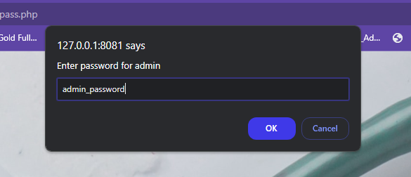
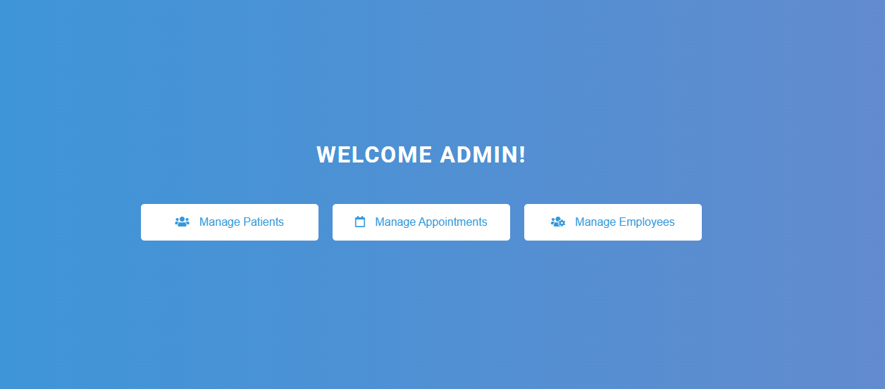
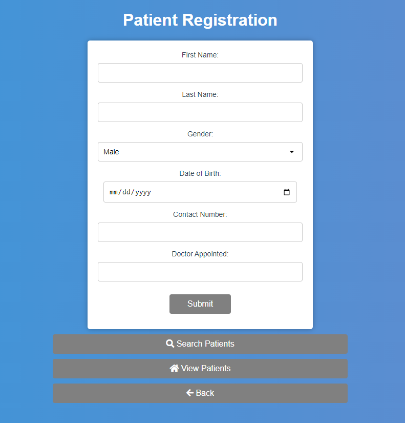
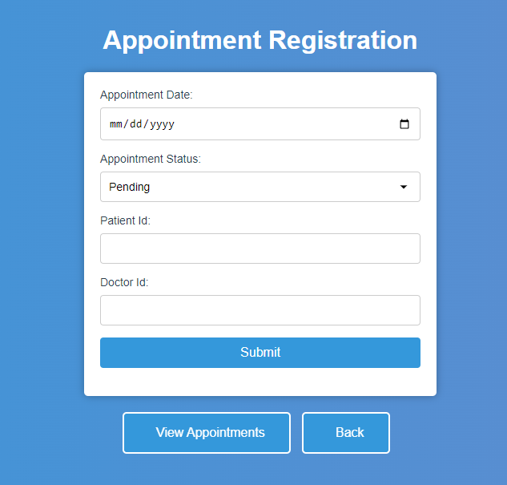
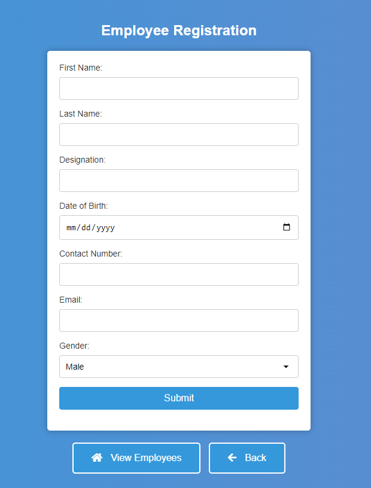
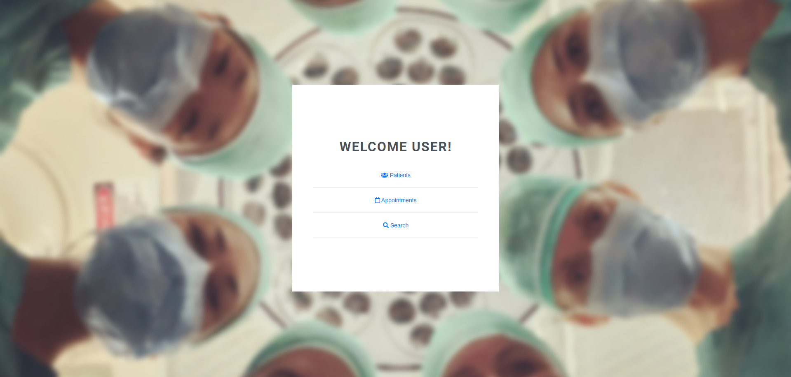
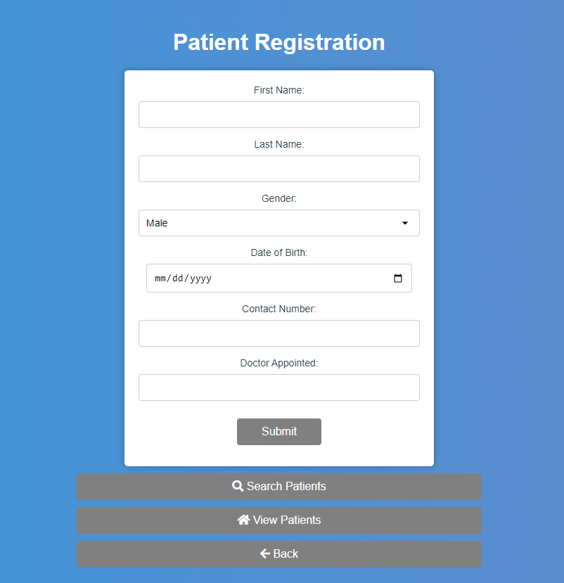
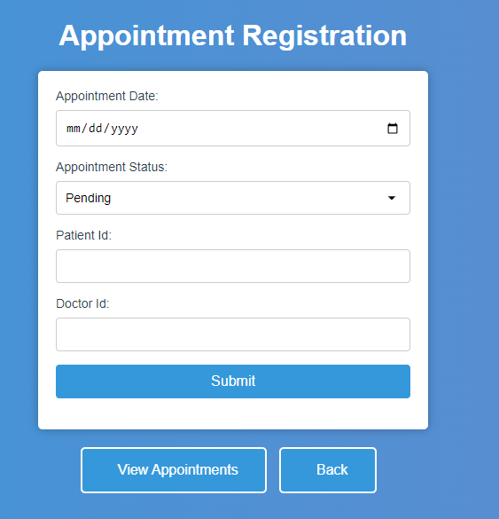

# A-Full-Flex-Hospital-Management-System
A Full Flex Hospital Management System using Html CSS JavaScript and PHP  
~ Author - Yash 

# Follow this steps to run the site
1. Run the pass.php file first
2. admin and user passwords you will get in firstpage.php
3. import the psyt.sql in your database using phpmyadmin

# Screenshots
1.Login page

2.Admin Section

3.User Section

